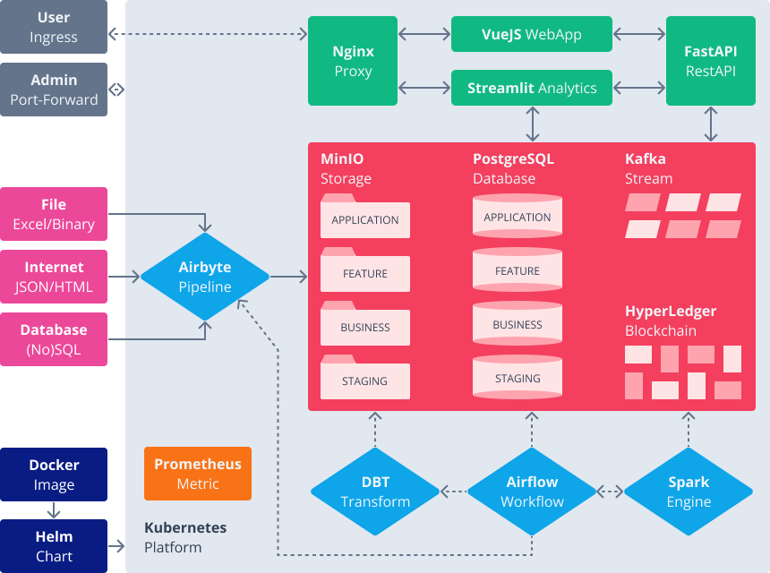

# FLIGHT

## OPEN-SOURCE

Commitment...

## [VueJS](vuejs/README.md)

An approachable, performant and versatile framework for building web user interfaces.

> Builds on top of standard HTML, CSS and JavaScript with intuitive API and documentation.
> Incrementally adoptable ecosystem that scales between a library and a full-featured framework.
> Truly reactive, compiler-optimized rendering system.

## [FastAPI](fastapi/README.md)

Modern and high-performance web framework for building APIs with Python based on standard type hints.

> Very high performance, on par with NodeJS and Go (thanks to Starlette and Pydantic).
> Based on (and fully compatible with) the open standards for APIs: OpenAPI and JSON Schema.

## [Streamlit](streamlit/README.md)

A faster way to build and share data apps. Streamlit turns data scripts into shareable web apps in minutes. All in pure Python.

> Build an app in a few lines of code with a simple API. Then see it automatically update as you iteratively save the source file.
> Adding a widget is the same as declaring a variable. No need to write a backend, handle HTTP requests, connect a frontend, ...
> Effortlessly share, manage and deploy your apps, directly from Streamlit Community Cloud.

## [Spark](spark/README.md)

Multi-language engine for executing data engineering, data science, and machine learning on single-node machines or clusters.

> Unify the processing of your data in batches and real-time streaming, using your preferred language: Python, SQL, Scala, Java or R.
> Execute fast, distributed ANSI SQL queries for dashboarding and ad-hoc reporting. Runs faster than most data warehouses.
> Perform Exploratory Data Analysis (EDA) on petabyte-scale data without having to resort to downsampling.
> Train machine learning algorithms on a laptop and use the same code to scale to fault-tolerant clusters of thousands of machines.

## [Airflow](airflow/README.md)

Platform created by the community to programmatically author, schedule and monitor workflows.

> Use standard Python features to create workflows, including date time formats for scheduling and loops to dynamically generate tasks.

## [Airbyte](airbyte/README.md)

EL(T) tool that syncs data from applications, APIs and databases to warehouses.

> Efficient (and easy) to synchronize SQL databases in a reliable way, to fetch data from popular public APIs.
> Deal with complex formats/dependencies in isolation through custom connectors for specific content manipulation.

## [DBT](dbt/README.md)

SQL-first transformation workflow that lets teams deploy analytics code following software engineering best practices.

> Replace boilerplate DDL/DML with simple SQL SELECT statements that infer dependencies, build tables and views, and run models in order. Allows modularity, portability, CI/CD, and documentation.

## [MinIO](minio/README.md)

High-performance, S3 compatible object store, built for large scale AI/ML, data lake and database workloads.

> Simplicity is the foundation for exascale data infrastructure - both technically and operationally.
> Turnkey multi-cluster deployment and management, providing freedom to innovate without lock-in or disruption.
> Native Kubernetes operator integration, it supports major Kubernetes distributions on public, private and edge clouds.

## [PostgreSQL](postgres/README.md)

Powerful, object-relational database system with a strong reputation for reliability, feature robustness, and performance.

> Latest versions raises its performance, with notable improvements to query parallelism, bulk data loading, and logical replication. Recent new features include more SQL/JSON syntax, new monitoring stats for your workloads, and greater flexibility in defining access control rules for management of policies across large fleets.

## [Kafka](kafka/README.md)

Distributed event streaming platform for high-performance data pipelines, streaming analytics and data integration.

> Deliver messages at network limited throughput with low latencies. Elastically expand and contract storage and processing. Store streams of data safely in a distributed, durable, fault-tolerant cluster.

## [Kubernetes](kubernetes/README.md)

Also known as K8s, is a system for automating deployment, scaling, and management of containerized applications.

> Groups containers that make up an application into logical units for easy management and discovery. Kubernetes can scale without increasing operations team.

## [Terraform](terraform/README.md)

Infrastructure automation to provision and manage resources in any cloud or data center.

> - Adopt: Compose infrastructure as code in a Terraform file using HCL to provision resources from any infrastructure provider.
> - Build: Infrastructure automation workflows to compose, collaborate, reuse, and provision infrastructure as code across IT operations and teams of developers.
> - Standardize: Establish guardrails for security, compliance, and cost management through role-based access controls, policy enforcement, and audit.
> - Scale: Extend workflow automation to all teams in the organization with self-service infrastructure as code and integrate with VCS, ITSM, and CI/CD.