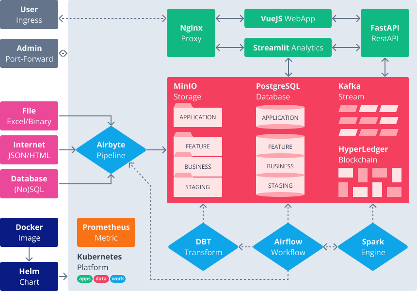

# PLAY

This project is a data science and web development playground, with some experiments on blockchain platforms. The main goal here is to learn new technologies, code insightful implementations, and share important concepts. In this way it is an ongoing work with a lot of opportunities yet to be taken and improvements to be done following two strategic approaches:

- Done is better than perfect because perfect is never done.
- Whoever does the work, does the learning.

## ARCHITECTURE

We strongly value concepts (as they last longer) over tools (which are interchangeable). Each development environment or prior knowledge will result in different stack choices and that's okay. Here we favor open source tools because of their quality, community and commitment to the learning process.

- [VueJS](webapp/README.md): an approachable, performant and versatile framework for building web user interfaces.
- [Streamlit](analytics/README.md): a faster way to build and share data (web) apps in pure Python, without frontend code.
- [FastAPI](restapi/README.md): modern and high-performance web framework to build APIs with Python and standard type hints.
- [Spark](engine/README.md): multi-language engine for executing data engineering/science, and machine learning on clusters.
- [Airflow](workflow/README.md): platform created by the community to programmatically author, schedule and monitor workflows.
- [Airbyte](pipeline/README.md): an EL(T) tool that syncs data from applications, APIs and databases to warehouses.
- [DBT](transform/README.md): SQL-first transformation tool to deploy analytics code following software engineering workflow.
- [MinIO](storage/README.md): high-performance, S3 compatible object store, built for large scale AI/ML warehouse workloads.
- [PostgreSQL](database/README.md): object-relational database with a strong reputation for reliability, robustness, and performance.
- [Kafka](stream/README.md): distributed event streaming system for high-performance data pipelines, analytics and data integration.
- [HyperLedger](blockchain/README.md): enterprise grade permissioned distributed ledger platform that offers modularity and versatility.
- [Kubernetes](platform/README.md): platform for automating deployment, scaling, and management of containerized applications.